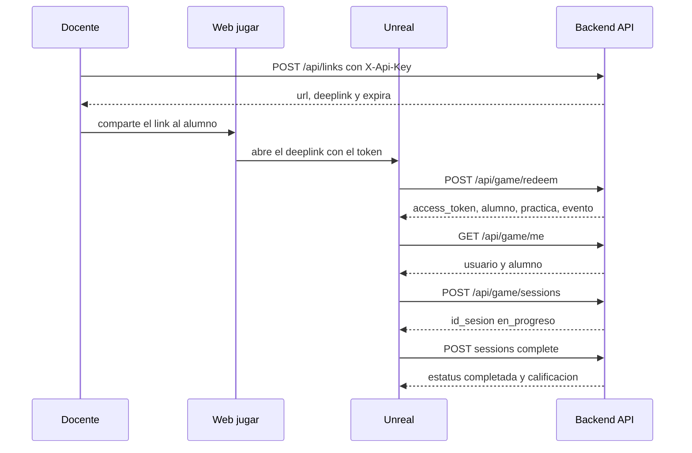

# Flujo del Juego — Metaverso Escolar TecNM

Este documento describe el flujo completo de autenticación y sesión entre el sistema docente, la web, el cliente Unreal Engine y la API backend.

## Diagrama de Secuencia

## Descripción del flujo

1. **Docente/Sistema** llama a `POST /api/links` con el header `X-Api-Key` para generar un magic link asociado a un usuario y evento. Recibe una URL web y un deeplink para Unreal.
2. El **alumno** abre la URL en su navegador (`/jugar/{token}`), donde hay un botón que activa el deeplink `tecnm-metaverso://play?token=...` abriendo el cliente Unreal.
3. **Unreal Engine** toma el token del deeplink y llama a `POST /api/game/redeem`. Si el token es válido y no ha expirado, la API lo marca como usado (operación atómica, un solo uso) y devuelve un Bearer token de Sanctum junto con datos del alumno, la práctica y el evento.
4. Con el Bearer token, Unreal llama a `GET /api/game/me` para confirmar la identidad del alumno.
5. Unreal llama a `POST /api/game/sessions` con el `id_evento` para iniciar una sesión de práctica. La API verifica la inscripción del alumno en el grupo del evento.
6. Al terminar, Unreal llama a `POST /api/game/sessions/{id}/complete` con la calificación (0–100) y datos opcionales de resultado. La sesión queda en estado `completada`.

## Seguridad

- El magic link es de **un solo uso** y expira en el tiempo configurado.
- El Bearer token de Sanctum tiene la capacidad (`ability`) `game` y expira según `SANCTUM_TOKEN_TTL_MINUTES` (por defecto 480 minutos).
- Los endpoints de juego requieren `Authorization: Bearer <token>` en cada request.
